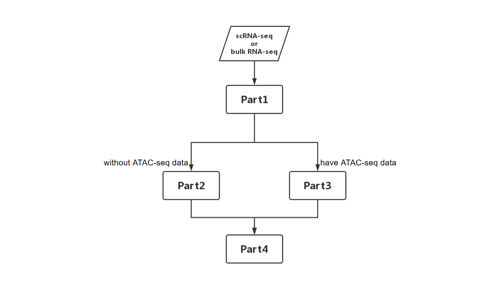
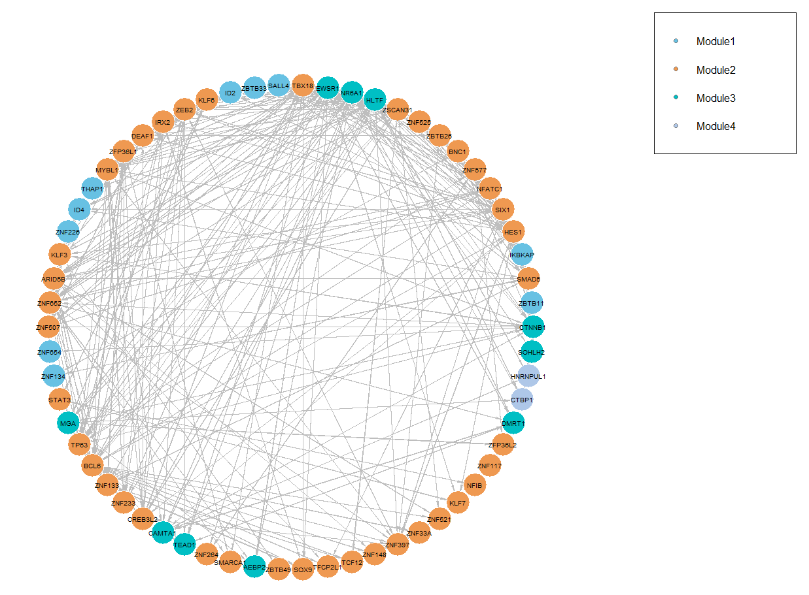
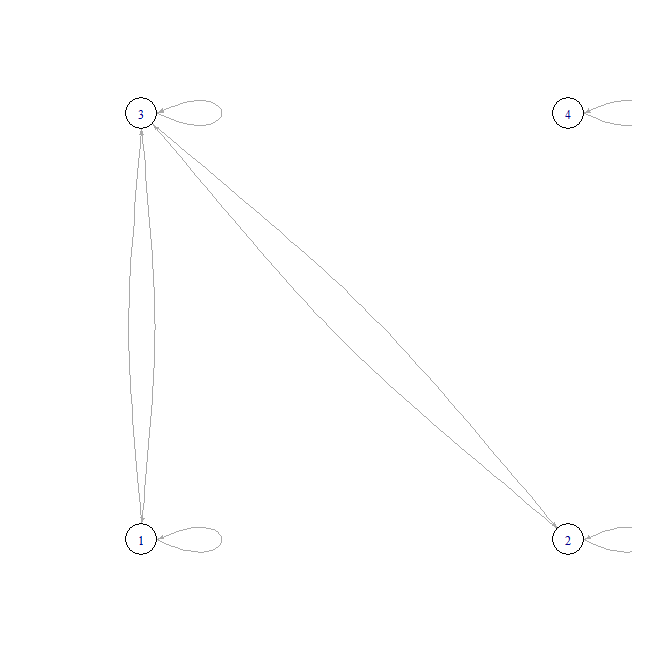
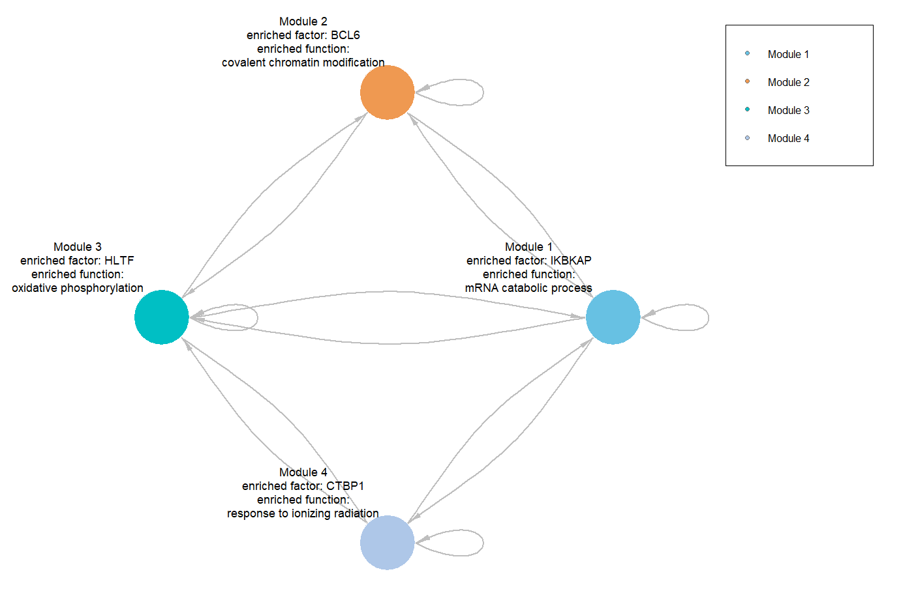

<!-- README.md is generated from README.Rmd. Please edit that file -->

```{r, include = FALSE}
knitr::opts_chunk$set(
  collapse = TRUE,
  comment = "#>",
  fig.path = "man/figures/README-",
  out.width = "100%"
)
```

# IReNA

<!-- badges: start -->
<!-- badges: end -->

IReNA (Integrated Regulatory Network Analysis) is to reconstruct regulatory networks through integrating scRNA-seq and ATAC-seq data. IReNA contains four main part to reconstruct regulatory network: 

Part1: Analyze scRNA-seq or bulk RNA-seq data to get basic regulatory relationships between transcription factors and genes.

Part2: Use RcisTarget to refine regulatory relaionships

Part3: Analyze ATAC-seq data to refine regulatory relationships

Part4: Regultory network analysis. 

If you **have ATAC-seq data**, use **part 3** to refine regulatory relationships. If you **don't have ATAC-seq data**, use **part 2** to refine regulatory relaionships

This README contains: (1) citation (2) test data download (3) Workflow of IReNA (4) ATAC-seq data preprocessing (5) IReNA input (6) Example 

## Installation
IReNA need R version 4.0 or higher.

First, install a few Bioconductor dependencies that aren't automatically installed:
```r
if (!requireNamespace("BiocManager", quietly = TRUE))
install.packages("BiocManager")
BiocManager::install(c('Rsamtools', 'ChIPseeker', 'monocle',
                       'RcisTarget', 'RCy3','clusterProfiler'))
```

Second, install IReNA from GitHub:
```r
install.packages("devtools")
devtools::install_github("jiang-junyao/IReNA")
```

## 1.Citation
If you use IReNA package, please cite the following Science paper: https://science.sciencemag.org/content/370/6519/eabb8598.

## 2.Test data download
Test data used below can be download from https://github.com/jiang-junyao/IReNA-test-data. If you want raw data of ATAC-seq to run [ATAC-seq analysis pipline](https://github.com/jiang-junyao/ATAC-seq-pipline), you can download it from https://www.ncbi.nlm.nih.gov/biosample?Db=biosample&DbFrom=bioproject&Cmd=Link&LinkName=bioproject_biosample&LinkReadableName=BioSample&ordinalpos=1&IdsFromResult=357084

## 3.Workflow


## 4.ATAC-seq data preprocessing
If you use ATAC-seq data to refine regulatory relaionships (part3), you need to preprocess ATAC-seq raw data(fastq) to get bam, peak and footprints. So we provide [ATAC-seq analysis pipline](https://github.com/jiang-junyao/ATAC-seq-pipline) for user to preprocess ATAC-seq data. The object of this pipline is to get bam file of each sample, peaks file of all samples and footprints of all samples as IReNA input. If you are familiar with ATAC-seq data analysis, you can do it as you like.

## 5.IReNA Input
Before run IReNA, you need to prepare 6 files, where bam file, Peak file, footprints file can be generated by [ATAC-seq analysis pipline](https://github.com/jiang-junyao/ATAC-seq-pipline) to generate these files. If you **only use scRNA-seq data or bulk RNA-seq data**, you just need to input **raw counts of scRNA-seq data, or Seurat object, or bulk RNA-seq expression profile(3), and motif database(6)**.

### (1).Bam file of each sample
Bam of IReNA input should be the consequence of step11 in [ATAC-seq analysis pipline](https://github.com/jiang-junyao/ATAC-seq-pipline).

### (2).Peak file of all samples
Peaks file used here should be bed format

### (3).Raw counts of scRNA-seq data, or Seurat object, or bulk RNA-seq expression profile. 
IReNA provides function to load raw counts of scRNA-seq data, and return seurat object. If your data is [10X format](https://support.10xgenomics.com/single-cell-gene-expression/software/pipelines/latest/output/matrices), set parameter datatype = 0. If your data is normal counts format(txt suffix), set parameter dayatype =1. If you have your own seurat object, you can skip load_counts, and use your own seurat object as 'seurat_object'.
```r
### load 10X counts
seurat_object <- load_counts('10X_data/sample1/', datatype = 0)
### load normal counts
seurat_object <- load_counts('test_data.txt',datatype = 1)
### read seurat object
seurat_object <- readRDS('seurat_object.rds')
```
If you use bulk RNA-seq data to get basic regulatory relationships, just input your bulk RNA-seq expression matrix as 'expression_profile', Use the same code as the scRNA-seq data to continue the analysis.

### (4).Footprints file
Footprints file can be generated by [HINT](http://www.regulatory-genomics.org/hint/introduction/) or [dnase2tf](https://github.com/jiang-junyao/dnase2tf) (I recommand HINT, because dnase2tf is not user friendly). The name of first column should be 'chr', name of second column should be 'start', name of third column should be 'end' and the fourth column should be pvalue or other score to evalute footprints.

### (5).Reference genome of your species
Reference genome needs to be the same as that used for mapping, you can download it from [UCSC](https://hgdownload.soe.ucsc.edu/downloads.html).

### (6).Motif database
IReNA contains DNA motif datasets for four species (Homo sapiens, Mus musculus, Zebrafish and Chicken) derived from [TRANSFAC 201803](https://genexplain.com/transfac/). Following codes are used to call  the motif dataset from TRANSFAC or  user-defined motif dataset which should have the same format as these from TRANSFAC database.
```r
library(IReNA)
###call Mus musculus motif database
motif1 <- Tranfac201803_Mm_MotifTFsF
###call Homo sapiens motif database
motif1 <- Tranfac201803_Hs_MotifTFsF
###call Zebrafish motif database
motif1 <- Tranfac201803_Zf_MotifTFsF
###call Chicken motif database
motif1 <- Tranfac201803_Ch_MotifTFsF
```


## 6.Example
IReNA contains four main part to reconstruct regulatory network: 

Part1: Analyze scRNA-seq or bulk RNA-seq data to get basic regulatory relationships

Part2: Use RcisTarget to refine regulatory relaionships

Part3: Analyze ATAC-seq data to refine regulatory relationships

Part4: Regultory network analysis. 

If you **have ATAC-seq data**, use **part3** to refine regulatory relationships. If you **don't have ATAC-seq data**, use **part2** to refine regulatory relaionships


### Part1: Analyze scRNA-seq or bulk RNA-seq data to get basic regulatory relationships
IReNA supports two input format: (i)path of raw counts, you can input path of raw counts and use function in GReNA to load data and convert it to Seurat object; (ii)Seurat object. After you upload the data, IReNA can calculate pseudotime according to R package monocle and add it to the metadata of Seurat object.

Our test seurat object only contains differentially expressed genes, so we set the parameter 'DEG' in add_pseudotime_DEG_filter() function as FALSE, if you seurat object contain all genes, please set this parameter as TRUE. In paraell, our test seurat object have been normalized, so we set the parameter 'normlize1' in add_pseudotime_DEG_filter() function as FALSE, if your seurat object only contains raw counts, please set this parameter as TRUE.

```{r include=FALSE}
library(IReNA)
```

```r
###Read seurat_object
seurat_object <- readRDS('seurat_object.rds')
###calculate the pseudotime and return monocle object
monocle_object <- get_pseudotime(seurat_object,show_trajecotry = TRUE)
###Add pseudotime to the Seurat object
seurat_with_time <- add_pseudotime_DEG_filter(seurat_object, monocle_object,DEG = FALSE,normlize1 = FALSE)
```
Then, cells are divided into 50 bins across pseudotime. The bin is removed if all genes in this bin have no expression. Gene is filtered if fold change < 0.01 (setting by the parameter FC). Then, genes will be clustered through K-means algorithm (K is setting by the parameter K1).
```
###Get expression profiles ordered by pseudotime
expression_profile <- get_SmoothByBin_PseudotimeExp(seurat_with_time, Bin = 50)
###Filter noise and logFC in expression profile
expression_profile_filter <- fileter_expression_profile(expression_profile, FC=0.01)
###K-means clustering
clustering <- clustering_Kmeans(expression_profile_filter, K1=4)
```

```{r}
clustering[1:5,1:5]
```

Visualize your clustering result through heatmap
```r
col1 <- c('#67C1E3','#EF9951','#00BFC4','#AEC7E8','#C067A9','#E56145','#2F4F4F')
###plot kmeans pheatmap
plot_kmeans_pheatmap(clustering, ModuleColor1 = col1,Range1=c(-3,3),NumRowBlank1=30,ModuleScale1 = 20)
```


Adding Ensmble ID of the genes in the first column, then calculate the correlation of the gene pair and select gene pairs which contain at least one gene in transcription factors database and have absolute value of correlation larger than 0.6(setting by the parameter correlatio_filter).
```{r}
###Add Ensembl ID as the first column of clustering results
Kmeans_clustering_ENS <- add_ENSID(clustering, Spec1='Hs')
Kmeans_clustering_ENS[1:5,1:5]
```
```r
### Caculate the correlation
motif1 <- Tranfac201803_Hs_MotifTFsF
regulatory_relaionships <- get_cor(Kmeans_clustering_ENS, motif = motif1, 0.6, start_column = 4)
```
### Part2: Use RcisTarget to refine regulatory relaionships (without ATAC-seq data)
For users who do not have ATAC-seq data, IReNA provides filter_regulation function (Based on RcisTarget) to refine regulation relaionships. Due to the limitations of RcisTarget, this function currently only supports three species (Hs, Mm and Fly). **So if the species of your data is not included, and you don't have ATAC-seq data, you can use unrefined regulatory relaionships to perform part4 analysis directly.**

Before run this function, you need to download Gene-motif rankings database from https://resources.aertslab.org/cistarget/, and set the Rankingspath1 as the path of downloaded Gene-motif rankings database. If you don’t know which database to choose, we suggest that using 'hg19-500bp-upstream-7species.mc9nr' for human, using 'mm9-500bp-upstream-10species.mc9nr' for mouse, using 'dm6-5kb-upstream-full-tx-11species.mc8nr' for Fly. You can download it manually, or use R code:
```r
### Download Gene-motif rankings database
featherURL <- "https://resources.aertslab.org/cistarget/databases/homo_sapiens/hg19/refseq_r45/mc9nr/gene_based/hg19-tss-centered-10kb-7species.mc9nr.feather"
download.file(featherURL, destfile=basename(featherURL)) # saved in current dir
### Refine regulatory relaionships
Rankingspath1 <- 'hg19-500bp-upstream-7species.mc9nr1.feather' # download from https://resources.aertslab.org/cistarget/
filtered_regulatory_relationships <- filter_regulation(regulatory_relationships, 'Hs', Rankingspath1)
```

### Part3: Analyze ATAC-seq data to refine regulatory relationships (have ATAC-seq data)
For users who have ATAC-seq data, IReNA provides several functions to calculate related transcription factors of footprints with high FOS to refine regulatory relationships. We merge footprints whose distance is less than 4 and get sequence from each footprints based on reference genome through function get_merged_fasta(). Reference genome should be fasta/fa format, and you can download it from https://hgdownload.soe.ucsc.edu/downloads.html#alpaca or other genome database website.
```r
###merge footprints whose distance is less than 4
filtered_footprints <- read.table('filtered_footprints.bed')
fastadir <- 'Genome/GRCm38Chr.fasta' 
merged_fasta <- get_merged_fasta(footprints_80th,fastadir)
write.table(merged_fasta,'merged_footprints.fasta',row.names=F,quote=F)
```
In this step, because [fimo](https://meme-suite.org/meme/doc/fimo.html) software only have linux version, and it takes too long to implement the corresponding function on Windows, we generate a shell script to run Fimo software in shell. If you are familiar with linux system and Fimo, you can write your own commands as you like.

First, you need to identify differentially expressed genes related motifs through motif_select() function, which can help you to reduce running time of the subsequent analysis process.

Before run find_motifs() function, you should set the following four parameters: (1) fimodir: path of fimo software, if you have added fimo to the environment variable, just set this argument as 'fimo'. (2) outputdir1: output path of shell script. (3) outputdir: output path of fimo result. (4) motifdir: path of motif file, you can download it from [TRANSFAC201803](https://genexplain.com/transfac/). (5) sequencedir: path of sequence which generated by get_merged_fasta(). Please note that, at the end of outputdir and sequencedir must contain / symbol.


```r
### Identify differentially expressed genes related motifs
motif1 <- motif_select(Tranfac201803_Hs_MotifTFsF, rownames(Kmeans_clustering_ENS)) ###Kmeans_clustering_ENS was obtained in part1
### run find_motifs()
fimodir <- 'fimo'
outputdir1 <- 'D:/GIBH/IReNA2 R package/IReNA2/ATAC/fimo/'
outputdir <- '/public/home/user/fimo/output/'
motifdir <- '/public/home/user/fimo/Mememotif/'
sequencedir <- '/public/home/user/fimo/merged_footprints.fasta'
find_motifs(motif1,step=20,fimodir, outputdir1, outputdir, motifdir, sequencedir)
```
Then you need to use [winscp](https://winscp.net/eng/download.php) or other related software to transfer script in outputdir1 to Linux system, and run following commands (If you make analysis in linux system, ignore transfer part).
```
### run the following commands in the shell
cd /public/home/user/fimo/
sh ./fimo_all.sh
```
After get the result of Fimo, you can use [winscp](https://winscp.net/eng/download.php) or other related software to transfer fimo result files from linux to windos(If you use R in linux, please ignore this part). Then, we combine these Fimo consequence according to motif and motif Position weight matrix, and Dir2 folder should only contain fimo result files. Next, we load the peaks file and overlap differential peaks and motif footprints through overlap_footprints_peaks() function
```r
###Combine all footprints of motifs
Dir2 <- 'D:/GIBH/IReNA2 R package/IReNA2/ATAC/fimo/'
combied <- combine_footprints(Dir2)
peaks <- read.delim('D:\\IReNA\\ATAC\\Peaks\\peaks_merged.txt')
overlapped <- overlap_footprints_peaks(combied,peaks)
```
However, the running time of overlap_footprints() is too long, so it's highly recommanded to use bedtools to do overlap in linux system. If you want to use bedtools to do overlap, you need to output 'combined_footprints' dataframe, and transfer it to shell.(If you make analysis in linux system, ignore transfer part)
```r
### output combined_footprints
write.table(combined_footprints,'combied.txt',quote = F,row.names = F,col.names = F,sep = '\t')
### run the following commands in the shell
bedtools intersect -a combied_footprints.txt -b peaks_merged.bed -wa -wb > overlappd.txt
```
Next, we intergrate bioconductor package [ChIPseeker](https://bioconductor.org/packages/release/bioc/vignettes/ChIPseeker/inst/doc/ChIPseeker.html) to get footprint-related genes. Before we run get_related_genes(), we need to specify TxDb, which can be download from: http://bioconductor.org/packages/release/BiocViews.html#___TxDb. Kmeans_clustering_ENS used here was obtained in part1.
```r
### If you make overlap by bedtools, read 'overlapped.txt' to R
overlapped <- read.table('overlapped.txt')
###get footprint-related genes
library(TxDb.Mmusculus.UCSC.mm10.knownGene)
txdb <- TxDb.Mmusculus.UCSC.mm10.knownGene
list1 <- get_related_genes(overlapped,txdb = txdb,motif=Tranfac201803_Mm_MotifTFsF,Species = 'Mm')
###Get candidate genes/TFs-related peaks
list2 <- get_related_peaks(list1,Kmeans_clustering_ENS)
### output filtered footprints
write.table(list2[[1]],'filter_footprints.bed', quote = F, row.names = F, col.names = F, sep = '\t')
```

In this step, we count the cuts of each position in footrprints by wig_track(), and use these cuts to calculate the FOS of footprints to identify enriched TFs which determine the regulatory relationship. regulatory_relationships used here was calculated in part1.
```r
bamfilepath1 <- 'SSC1_filter.bam'
bamfilepath2 <- 'SSC2_filter.bam'
bamfilepath3 <- 'esc.bam'
cuts1 <- wig_track(bamfilepath = bamfilepath1,bedfile = list2[[1]])
cuts2 <- wig_track(bamfilepath = bamfilepath2,bedfile = list2[[1]])
cuts3 <- wig_track(bamfilepath = bamfilepath3,bedfile = list2[[1]])
wig_list <- list(cuts1,cuts2,cuts3)
potential_regulation <- Footprints_FOS(wig_list,list2[[2]])
### Calculate correaltion of each gene pairs
filtered_regulatory_relationships <- regulatory_relationships[regulatory_relationships$TF %in% potential_regulation$TF & regulatory_relationships$Target %in% potential_regulation$Target,]
```

### Part4: Regulatory network analysis
After we get 'filtered_regulatory_relationships' and 'Kmeans_clustering_ENS', we can reconstruct regulatory network. Run network_analysis() to get regulatory, this step will generate a list which contain the following 9 dataframes: 

(1)Cor_TFs.txt: list of expressed TFs in the gene networks. 

(2)Cor_EnTFs.txt: list of TFs which significantly regulate gene modules (or enriched TFs). 

(3)FOSF_RegMTF_Cor_EnTFs.txt: regulatory pairs in which the source gene is enriched TF. 

(4)FOSF_RegMTF_Cor_EnTFs.txt: regulatory pairs in which both source gene and target gene are enriched TFs.

(5)FOSF_RegMTF_Cor_EnTFs.txt: regulatory pairs only including regulations within each module but not those between modules, in this step

(6)TF_list: enriched TFs which significantly regulate gene modules

(7)TF_module_regulation: details of enriched TFs which significantly regulate gene modules

(8)TF_network: regulatory network for enriched transcription factors of each module

(9)intramodular_network: intramodular regulatory network
```r
TFs_list <- network_analysis(regulatory_relationships,Kmeans_cluster_Ens,TFFDR1 = 10,TFFDR2 = 50)
```
We can also make enrichment analysis for differentially expressed genes in each module. Before you run this function, you need to download the org.db for your species through BiocManager.
```{r warning = FALSE, message = FALSE}
### Download Homo sapiens org.db
#BiocManger::install('org.Hs.eg.db')
library(org.Hs.eg.db)
### Enrichment analysis
enrichment_KEGG <- enrich_module(Kmeans_clustering_ENS, org.Hs.eg.db, 'KEGG')
#enrichment_GO <- enrich_module(Kmeans_cluster_ENS, org.Hs.eg.db, 'GO')
head(enrichment_KEGG)
```

You can visualize regulatory network for enriched transcription factors of each module through plot_network() function by setting type parameter as 'TF'. This plot shows regulatory relationships between transcription factors in different modules that significantly regulate other modules.
```
plot_network(TFs_list,layout = 'circle',type = 'TF')
```


You can visualize intramodular network through plot_network() function by setting type parameter as 'module'. This plot shows regulatory relationships between each modules. The transcription factor on each node play the most important roles in this module (transcription factor that have the most edges in regulatory network for enriched transcription factors of each module).
```r
plot_network(TFs_list,layout = 'random',type = 'module',vertex.size = 25,vertex.label.cex = 1.1,edge.with = 2,arrow.size = 0.5)
```

You can also visualize intramodular network with enriched function through plot_network() function by setting enrichment parameter as consequence of enrich_module(). In this graph, in addition to showing the most important transcription factors, it also shows the enriched function with the highest -log10(qvalue).
```r
plot_network(TFs_list,enrichment = enrichment_KEGG,layout = 'random',type = 'module',vertex.size = 25,vertex.label.cex = 1.1,edge.with = 2,arrow.size = 0.5)
```

It is strongly recommended to use Cytoscape(downloading link: https://cytoscape.org/download.html) to display the regulatory networks. We provide a function that can provide different Cytoscape styles. You need to intall and open Cytoscape before running the function.
```r
###optional: display the network in cytoscape, open cytoscape before running this function
initiate_cy(tf_network, layout1='degree-circle', type='TF')
initiate_cy(intramodule_network, layout1='grid', type='module')
```

## Help and Suggestion
If you have any question, comment or suggestion, please use github issue tracker to report coding related issues of CellChat or contact cellchat.package@gmail.com. I will answer you timely, and please remind me again if you have not received response more than three days.
