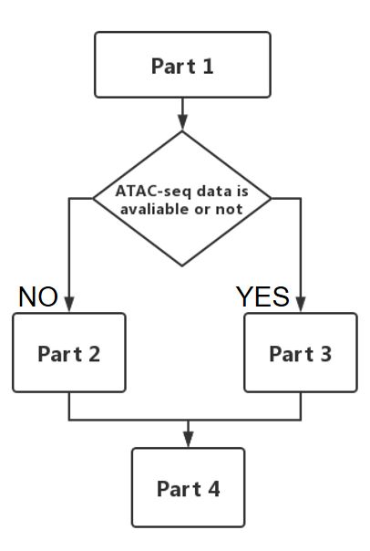

<!-- README.md is generated from README.Rmd. Please edit that file -->

```{r, include = FALSE}
knitr::opts_chunk$set(
  collapse = TRUE,
  comment = "#>",
  fig.path = "man/figures/README-",
  out.width = "100%"
)
```
`r badger::badge_custom("r", "version4.04", "green", "https://www.r-project.org")`
`r badger::badge_custom("Seurat", "version4.01", "red", "https://satijalab.org/seurat/articles/get_started.html")`
`r badger::badge_custom("monocle", "version2.18", "blue", "http://cole-trapnell-lab.github.io/monocle-release")`
`r badger::badge_custom("publication", "iscience", "purple", "https://www.cell.com/iscience/pdf/S2589-0042(22)01631-5.pdf")`


IReNA (Integrated Regulatory Network Analysis) is an R package to perform regulatory network analysis. IReNA contains two methods to reconstruct gene regulatory networks. The first is using single-cell RNA sequencing (scRNA-seq) data alone. The second is integrating scRNA-seq data and chromatin accessibility profiles from Assay for Transposase Accessible Chromatin using sequencing (scATAC-seq or bulk ATAC-seq). IReNA performs modular regulatory network to reveal key transcription factors and significant regulatory relationships among modules, providing biological insights on regulatory mechanisms.

## Workflow

{ width=80% height=80% }

## Installation

IReNA needs R version 4.0 or higher, and [Bioconductor](http://bioconductor.org/) version 3.12.

First, install Bioconductor, open R platform and run:
```r
if (!requireNamespace("BiocManager", quietly = TRUE))
install.packages("BiocManager")
BiocManager::install(version = "3.12")
```

Next, install several Bioconductor dependencies:
```r
BiocManager::install(c('Rsamtools', 'ChIPseeker', 'monocle',
                       'RcisTarget', 'RCy3', 'clusterProfiler'))
```

Then, install IReNA from GitHub:
```r
install.packages("devtools")
devtools::install_github("jiang-junyao/IReNA")
```

Finally, check whether IReNA was installed correctly, restart R session and run:
```r
library(IReNA)
```

## Quick start

* [Run IReNA based on seurat object (without pre-build GRN and gene modules)](https://jiang-junyao.github.io/IReNA/qucik-start)

* [Run IReNA based on pre-build GRN and gene modules](https://jiang-junyao.github.io/IReNA/qucik-start2)

## NEWs

2024.10.17 add qucik start tutorial at the ReadME page.

## Full tutorials

* [Regulatory network analysis through only scRNA-seq data](https://jiang-junyao.github.io/IReNA/only-scRNA)


* [Regulatory network analysis through intergrating scRNA-seq data and scATAC-seq data](https://jiang-junyao.github.io/IReNA/scATAC+scRNA)


* [Regulatory network analysis through intergrating scRNA-seq data and bulk ATAC-seq data](https://jiang-junyao.github.io/IReNA/bulk-ATAC+scRNA)


## External links

An example for [using IReNA to identify transcription factors critical for retinal regeneration](https://github.com/jiewwwang/Single-cell-retinal-regeneration)

## Citation
Official publication: [IReNA: integrated regulatory network analysis of single-cell transcriptomes](https://www.cell.com/iscience/pdf/S2589-0042(22)01631-5.pdf)

## Help and Suggestion

If you have any question, comment or suggestion, please use github issue tracker to report issues of IReNA or contact <jyjiang@link.cuhk.edu.hk>. I will answer you timely, and please remind me again if you have not received response more than three days.
