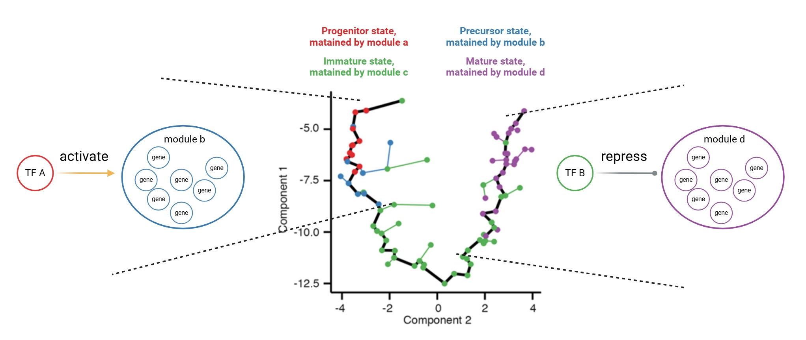

<!-- README.md is generated from README.Rmd. Please edit that file -->

```{r, include = FALSE}
knitr::opts_chunk$set(
  collapse = TRUE,
  comment = "#>",
  fig.path = "man/figures/README-",
  out.width = "100%"
)
```
`r badger::badge_custom("r", "version4.04", "green", "https://www.r-project.org")`
`r badger::badge_custom("Seurat", "version4.01", "red", "https://satijalab.org/seurat/articles/get_started.html")`
`r badger::badge_custom("monocle", "version2.18", "blue", "http://cole-trapnell-lab.github.io/monocle-release")`
`r badger::badge_custom("publication", "iscience", "purple", "https://www.cell.com/iscience/pdf/S2589-0042(22)01631-5.pdf")`

## Significance of IReNA

There are several cell states involved in cell development or disease occurrence (e.g., progenitor, precursor, immature, and mature), each state maintained by a unique gene program (**modules**). Decoding the **inter**- or **intra**-regulatory mechanisms among these modules can further elucidate the key mechanisms that regulate cell state transitions, including identifying key transcription factors that regulate cell fate decisions or cell differentiation. Most current gene regulatory network (GRN) analysis methods focus on **intra**-module regulations; they select all cell states or single cell states to construct GRNs and **neglect inter**-module regulations. 

IReNA can address this gap by identifying transcription factors (TFs) that regulate other modules and inferring inter-module interactions through hypergeometric tests. For instance, if IReNA identifies **TF A** from **module a** significantly activating **module b**, we can infer that TF A may regulate the differentiation of the Progenitor state into the Precursor state. In a second case, if IReNA identifies **TF B** from **module c** significantly repressing **module d**, we can infer that TF B represses the differentiation process from the Immature state to the Mature state.

{ width=80% height=80% }

## Workflow

{ width=60% height=60% }

## Installation

IReNA needs R version 4.0 or higher, and [Bioconductor](http://bioconductor.org/) version 3.12.

First, install Bioconductor, open R platform and run:
```r
if (!requireNamespace("BiocManager", quietly = TRUE))
install.packages("BiocManager")
BiocManager::install(version = "3.12")
```

Next, install several Bioconductor dependencies:
```r
BiocManager::install(c('Rsamtools', 'ChIPseeker', 'monocle',
                       'RcisTarget', 'RCy3', 'clusterProfiler'))
```

Then, install IReNA from GitHub:
```r
install.packages("devtools")
devtools::install_github("jiang-junyao/IReNA")
```

Finally, check whether IReNA was installed correctly, restart R session and run:
```r
library(IReNA)
```

## Quick start

* [Run IReNA based on seurat object (without pre-build GRN and gene modules)](https://jiang-junyao.github.io/IReNA/qucik-start)

* [Run IReNA based on pre-build GRN and gene modules](https://jiang-junyao.github.io/IReNA/qucik-start2)

## NEWs

2024.10.17 add qucik start tutorial at the ReadME page.

## Full tutorials

* [Regulatory network analysis through only scRNA-seq data](https://jiang-junyao.github.io/IReNA/only-scRNA)


* [Regulatory network analysis through intergrating scRNA-seq data and scATAC-seq data](https://jiang-junyao.github.io/IReNA/scATAC+scRNA)


* [Regulatory network analysis through intergrating scRNA-seq data and bulk ATAC-seq data](https://jiang-junyao.github.io/IReNA/bulk-ATAC+scRNA)


## External links

An example for [using IReNA to identify transcription factors critical for retinal regeneration](https://github.com/jiewwwang/Single-cell-retinal-regeneration)

## Citation
Official publication: [IReNA: integrated regulatory network analysis of single-cell transcriptomes](https://www.cell.com/iscience/pdf/S2589-0042(22)01631-5.pdf)

## Help and Suggestion

If you have any question, comment or suggestion, please use github issue tracker to report issues of IReNA or contact <jyjiang@link.cuhk.edu.hk>. I will answer you timely, and please remind me again if you have not received response more than three days.
