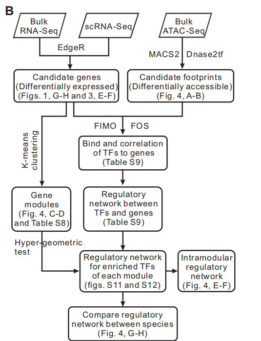

<!-- README.md is generated from README.Rmd. Please edit that file -->

# IReNA

<!-- badges: start -->
<!-- badges: end -->

IReNA (Integrated Regulatory Network Analysis) is to reconstruct
regulatory networks through integrating scRNA-seq and ATAC-seq data.

## Citation

If you use IReNA package, please cite the following Science
paper: <https://science.sciencemag.org/content/370/6519/eabb8598>.

## Workflow



## Installation

First, install Rsamtools and ChIPseeker packages which are needed to run
IReNA.

``` r
install.packages('BiocManager')
BiocManager::install('Rsamtools')
BiocManager::install('ChIPseeker')
```

Second, to install IReNA from GitHub, run:

``` r
install.packages("devtools")
devtools::install_github("jiang-junyao/IReNA")
```

## ATAC-seq upstream data anaylsis

IReNA need the consequence of ATAC-seq upstream data analysis, so we
provide [ATAC-seq analysis
pipline](https://github.com/jiang-junyao/ATAC-seq-pipline) for user who
is not familiar with ATAC-seq upstream data anaylsis. If you are a old
stager in ATAC-seq, just choose the pipline you perfer.

## IReNA Input

Before run IReNA, you need to prepare 7 files which will be used through
the analysis process, where bam file, Peak file, footprints file can be
generated by [ATAC-seq analysis
pipline](https://github.com/jiang-junyao/ATAC-seq-pipline) to generate
these files, Modularized expression profile can be generated by
[GReNA](https://github.com/jiang-junyao/GReNA).

### 1.Bam file of each sample

Bam file that can be generated by [samtools](http://www.htslib.org/).
Note that you need to de-duplicate and sort these BAM files through
rmdup and sorted function of samtools respectively.

### 2.Peak file of all samples

You can use MACS2 to call peaks of each sample, and use XXX() function
in IReNA to merge these peaks.

### 3.Modularized expression profile

You can use [GReNA](https://github.com/jiang-junyao/GReNA) package to
analyze scRNA-seq or bulk RNA-seq data to get modularized expression
profile. Modularized expression profile used here should be the
consequence of add\_ENSID() function in GReNA. If you use your own
expression profile, row names of your expression profile should be
ENSEMBEL ID of genes, name of first column Symbol ID of genes, name of
second column should be the Group of genes. We store sample data in
IReNA, you can use following code to get it.

``` r
library(IReNA)
#> 
expression_profile <- MmscRNA_PHx_Exp_NewF
expression_profile[1:5,1:5]
#>                    Symbol Group FoldChangeQ95 MmLDSmExp1 MmLDSmExp2
#> ENSMUSG00000033845 Mrpl15     1      2.151861   3.032626   2.465037
#> ENSMUSG00000025917  Cops5     1      1.970659   3.671971   1.600169
#> ENSMUSG00000079658  Tceb1     1      3.677006   7.679324   4.155339
#> ENSMUSG00000025934  Gsta3     1      4.884573   6.170908   5.335057
#> ENSMUSG00000061518  Cox5b     1      3.988575   8.783776   5.109202
```

### 4.Footprints file

Footprints file can be generated by
[HINT](http://www.regulatory-genomics.org/hint/introduction/) or
[dnase2tf](https://github.com/jiang-junyao/dnase2tf) (I recommand HINT,
because dnase2tf is not user friendly). The name of first column should
be ‘chr’, name of second column should be ‘start’, name of third column
should be ‘end’ and the fourth column should be pvalue or other score to
evalute footprints.

### 5.Reference genome of your species

Reference genome needs to be the same as that used for mapping, you can
download it from [UCSC](https://hgdownload.soe.ucsc.edu/downloads.html).

### 6.Motif database

IReNA contains DNA motif datasets for four species (Homo sapiens, Mus
musculus, Zebrafish and Chicken) derived from [TRANSFAC
201803](https://genexplain.com/transfac/). Following codes are used to
call the motif dataset from TRANSFAC or user-defined motif dataset which
should have the same format as these from TRANSFAC database.

``` r
library(IReNA)
###call Mus musculus motif database
motif1 <- Tranfac201803_Mm_MotifTFsF
###call Homo sapiens motif database
motif1 <- Tranfac201803_Hs_MotifTFsF
###call Zebrafish motif database
motif1 <- Tranfac201803_Zf_MotifTFsF
###call Chicken motif database
motif1 <- Tranfac201803_Ch_MotifTFsF
```

### 7.Position weight matrix

IReNA contain position weight matrix from
[TRANSFAC201803](https://genexplain.com/transfac/), you can use the
following code to call it, or you can use your own position weight
matrix.

``` r
PWM <- Tranfac201803_MotifPWM
```

## Example

### Step 3: Perform IReNA

First, we merge footprints whose distance is less than 4 and get fasta
from each footprints based on reference genome through function
get\_merged\_fasta(). Reference genome should be fasta/fa format, and
you can download it from
<https://hgdownload.soe.ucsc.edu/downloads.html#alpaca> or other genome
database website.

``` r
###merge footprints whose distance is less than 4
fdr005 <- read.table('mmATACPhxW_CuFiQ10No_sorted_fdr0.050000.bed',,sep='\t',header = T)
fastadir <- 'Genome/GRCm38Chr.fasta' 
merged_fasta <- get_merged_fasta(fdr005,fastadir)
write.table(merged_fasta,'merged_footprints.fasta',row.names=F,quote=F)
```

In this step, because [fimo](https://meme-suite.org/meme/doc/fimo.html)
software only have linux version, and it takes too long to implement the
corresponding function on Windows, we generate a shell script to run
Fimo software in shell. If you are familiar with linux system and Fimo,
you can write your own commands as you like.

Before run find\_motifs() function, you should set the following four
parameters: (1) fimodir: path of fimo software, if you have added fimo
to the environment variable, just set this argument as ‘fimo’. (2)
outputdir1: output path of shell script. (3) outputdir: output path of
fimo result. (4) motifdir: path of motif file, you can download it from
[TRANSFAC201803](https://genexplain.com/transfac/). (5) sequencedir:
path of sequence which generated by get\_merged\_fasta(). Please note
that, at the end of outputdir and sequencedir must contain / symbol.

``` r
fimodir <- 'fimo'
outputdir1 <- 'D:/GIBH/IReNA2 R package/IReNA2/ATAC/fimo/'
outputdir <- '/public/home/user/fimo/output/'
motifdir <- '/public/home/user/fimo/Mememotif/'
sequencedir <- '/public/home/user/fimo/merged_footprints.fasta'
find_motifs(motif1,step=20,fimodir, outputdir1, outputdir, motifdir, sequencedir)
```

Then you need to use [winscp](https://winscp.net/eng/download.php) or
other related software to transfer script in outputdir1 to Linux system,
and run following commands (If you use R in linux, please ignore this
part).

    ### run the following commands in the shell
    cd /public/home/user/fimo/
    sh ./fimo_all.sh

After get the result of Fimo, you can use
[winscp](https://winscp.net/eng/download.php) or other related software
to transfer fimo result files from linux to windos(If you use R in
linux, please ignore this part). Then, we combine these Fimo consequence
according to motif and motif Position weight matrix, and Dir2 folder
should only contain fimo result files. Next, we load the peaks file and
overlap differential peaks and motif footprints through
overlap\_footprints\_peaks() function

``` r
###Combine all footprints of motifs
PWM <- Tranfac201803_MotifPWM ###choose PWM
Dir2 <- 'D:/GIBH/IReNA2 R package/IReNA2/ATAC/fimo/'
combied <- combine_footprints(motif1, PWM, Dir2)
peaks <- read.delim('D:\\IReNA\\ATAC\\Peaks\\peaks_merged.txt')
overlapped <- overlap_footprints_peaks(combied,peaks)
```

However, the running time of overlap\_footprints() is too long, so it’s
highly recommanded to use bedtools to do overlap in linux system:

``` r
write.table(combied_footprints,'combied.txt',quote = F,row.names = F,col.names = F,sep = '\t')
### run the following commands in the shell
bedtools intersect -a combied_footprints.txt -b peaks_merged.bed -wa -wb > overlappd.txt
```

Next, we intergrate bioconductor package
[ChIPseeker](https://bioconductor.org/packages/release/bioc/vignettes/ChIPseeker/inst/doc/ChIPseeker.html)
to get footprint-related genes. Before we run get\_related\_genes(), we
need to specify TxDb, which can be download from:
<http://bioconductor.org/packages/release/BiocViews.html#___TxDb>.

``` r
###Merge and extend footprint regions
overlapped <- read.table('overlapped.txt')
###get footprint-related genes
library(TxDb.Mmusculus.UCSC.mm10.knownGene)
txdb <- TxDb.Mmusculus.UCSC.mm10.knownGene
list1 <- get_related_genes(overlapped,txdb = txdb,motif=Tranfac201803_Mm_MotifTFsF,Species = 'Mm')
###Get candidate genes/TFs-related peaks
expression <- read.delim('D:\\GIBH\\IReNA2 R package\\IReNA2\\scRNA\\MmscRNA_PHx_Exp_NewF.txt')
list2 <- get_related_peaks(list1,expression)
write.table(list2[[1]],'filter_footprints.txt', quote = F, row.names = F, col.names = F, sep = '\t')
```

Use samtools or bedtools to extract footprints realated regions in bam
to reduce analysis time of next step.

``` r
### Use bedtools
bedtools intersect -a  sample1_rmdup.bam  -b filtered_footprint.bed  > sample1_filter.bam
bedtools intersect -a  sample2_rmdup.bam  -b filtered_footprint.bed  > sample2_filter.bam
bedtools intersect -a  sample3_rmdup.bam  -b filtered_footprint.bed  > sample3_filter.bam
### Use samtools
samtools view -hb -L filtered_footprint.bed sample1_rmdup.bam > sample1_filter.bam
samtools view -hb -L filtered_footprint.bed sample2_rmdup.bam > sample2_filter.bam
samtools view -hb -L filtered_footprint.bed sample3_rmdup.bam > sample3_filter.bam
```

In this step, we count the cuts of each position in footrprints by
wig\_track(), and use these cuts to calculate the FOS of footprints to
identify enriched TFs which determine the regulatory relationship.

``` r
bamfilepath1 <- 'sample1_filter.bam'
bamfilepath2 <- 'sample2_filter.bam'
bamfilepath3 <- 'sample3_filter.bam'
cuts1 <- wig_track(bamfilepath = bamfilepath1,bedfile = list2[[1]])
cuts2 <- wig_track(bamfilepath = bamfilepath2,bedfile = list2[[1]])
cuts3 <- wig_track(bamfilepath = bamfilepath3,bedfile = list2[[1]])
wig_list <- list(cuts1,cuts2,cuts3)
regulatory_relationships <- Footprints_FOS(wig_list,list2[[2]],MmscRNA_PHx_Exp_NewF)
```

Use functions in GReNA to get regulatory networks for enriched TFs of
each module and intramodular network. For more details of GReNA, please
see <https://github.com/jiang-junyao/GReNA>

``` r
devtools::install_github('jiang-junyao/GReNA')
library(GReNA)
TFs_list <- get_Enriched_TFs(regulatory_relationships, MmscRNA_PHx_Exp_NewF, TFFdrThr1=2)
###Perform enrichment analysis of TFs###Get the list of enriched TFs 
TFs_list <- get_regulation_of_TFs_to_modules(TFs_list, Thr=10)
###Get regulatory networks which consist of enriched TFs
tf_network <- get_partial_regulations(TFs_list)
TFs_list <- get_Enriched_TFs(regulatory_relationships, Kmeans_clustering_ENS, TFFdrThr1=2)
###Generate intermodular regulatory networks
intramodular_network <- merge_Module_Regulations(TFs_list, Kmeans_clustering, ModuleThr1=0.05)
```
